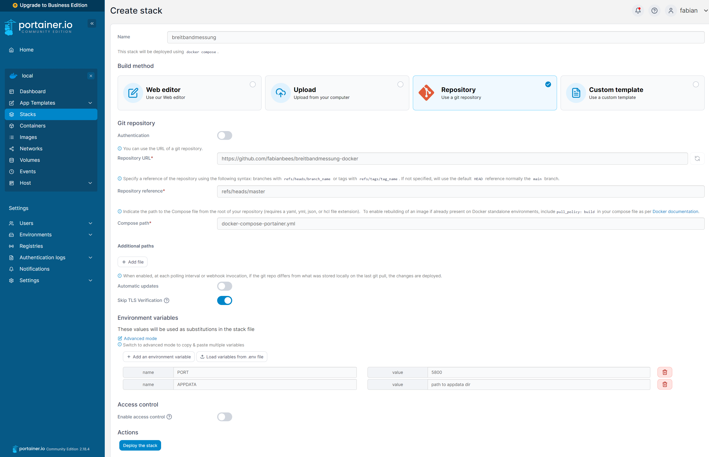
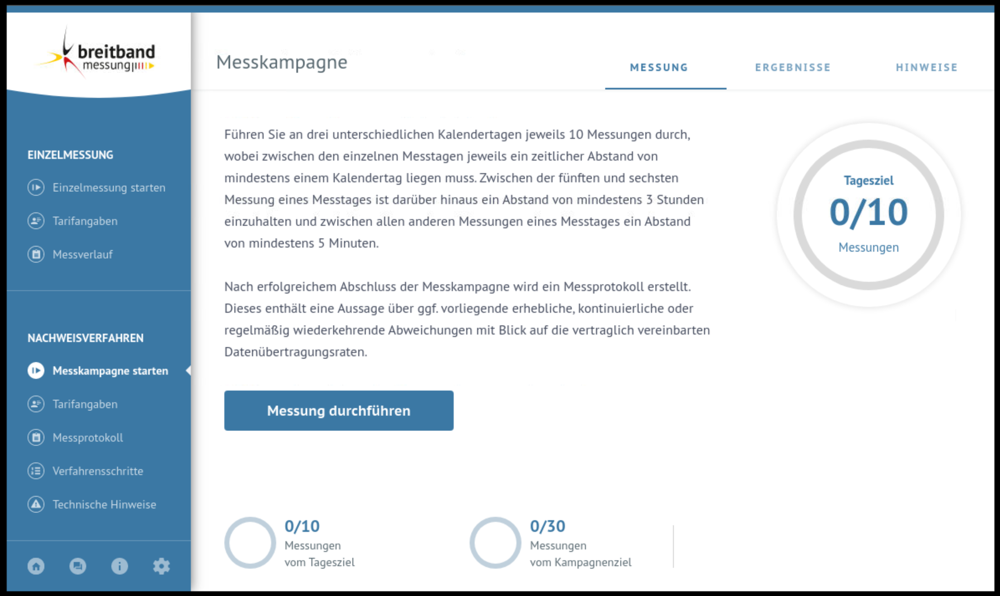
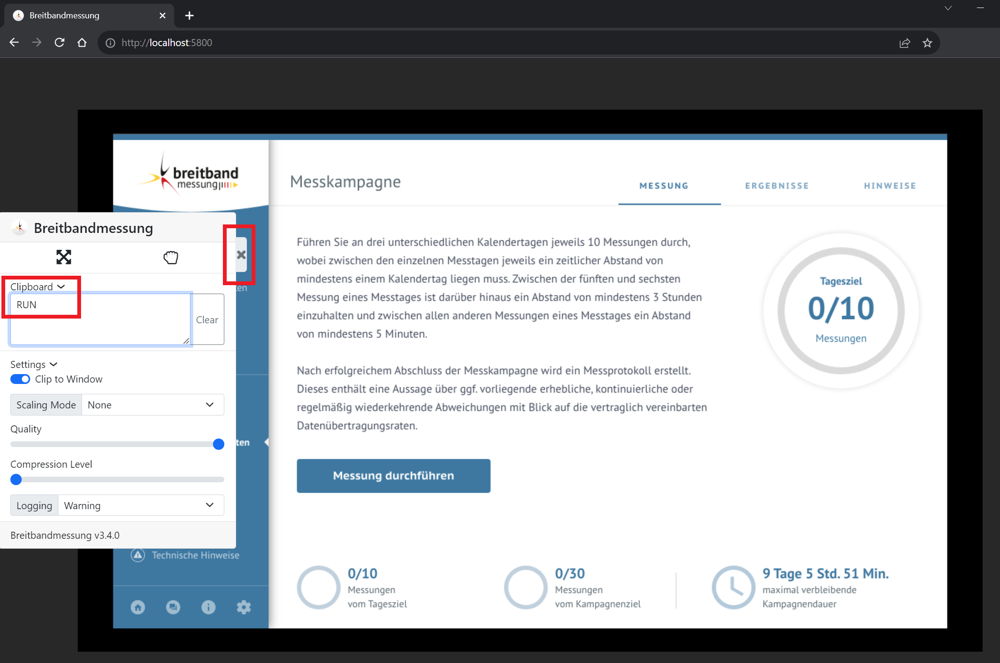

# Breitbandmessung.de Docker Container


Setup the container in these five steps:

1. Deploy the container through one of the deployment options.
(The initial start can take a multiple seconds, depending on your internet connction.)

2. Configure your "Tarifangaben" inside the breibandmessung App.

3. (optional) Start the automation for automatic measurements. (see ➡️ [Automated Speedtesting](#automated-speedtesting))


## Tags

| Registry | Image | Tag | Build |
|:------------------:|:------------------:|:--------------:|:-----------------:|
| [Docker-Hub](https://hub.docker.com/r/fabianbees/breitbandmessung/tags) | fabianbees/breitbandmessung | latest |  |
| [Github (ghcr.io)](https://github.com/fabianbees/breitbandmessung-docker/pkgs/container/breitbandmessung-docker/versions?filters%5Bversion_type%5D=tagged) | ghcr.io/fabianbees/breitbandmessung-docker | latest | [](https://github.com/fabianbees/breitbandmessung-docker/actions/workflows/build_docker_image.yml) |
| [Github (ghcr.io)](https://github.com/fabianbees/breitbandmessung-docker/pkgs/container/breitbandmessung-docker/versions?filters%5Bversion_type%5D=tagged) | ghcr.io/fabianbees/breitbandmessung-docker | staging | [](https://github.com/fabianbees/breitbandmessung-docker/actions/workflows/build_docker_image.yml) |


## Deploy via docker run

The container can be run via plain docker:

```bash
docker run -d \
    --name breitband-desktop \
    -e TZ=Europe/Berlin  `#optional (default)` \
    -v $PWD/breitbandmessung/data:/config/xdg/config/Breitbandmessung \
    -p 5800:5800 \
    fabianbees/breitbandmessung:latest
```

Appdata for the Breitbandmessung Desktop App lives in the following directory (inside the container): ```/config/xdg/config/Breitbandmessung```. Therefore this directory should be mounted to a host directory.


## Deploy via docker-compose

Deploy container via docker-compose v3 schema:

```bash
git clone https://github.com/fabianbees/breitbandmessung-docker.git

cd breitbandmessung-docker

docker compose up
```


```yaml
version: "3.8"
services:
  breitband-desktop:
    image: fabianbees/breitbandmessung:latest
    container_name: breitband-desktop
    environment:
      - TZ=Europe/Berlin
    volumes:
      - $PWD/breitbandmessung/data:/config/xdg/config/Breitbandmessung
    ports:
      - 5800:5800
    restart: unless-stopped
```


## Deploy as Portainer Stack

<details>
<summary>see screenshot (click to expand)</summary>
<br>

</details>


## Automated Speedtesting

### Setup breitbandmessung.de

1. Open your browser with the following url: http://ip-of-docker-host:5800


2. Go throgh setup process, until you reach the following page:

**DO NOT KLICK THE BUTTON "Messung durchführen" if you want to use the Speedtest automation script!**
--> The automation script requires this exact screen to be shown for the automatic execution of a "Messkampagne".


### Start automation via GUI (easy method)

3. To start the script, use the website on the exposed port and put the string 'RUN' in the clipboard. To stop the script, remove the string. You may need to do this twice (error unknown). After a maximum of 15 seconds you should see the screen in action. 


```⚠️ If the clipboard method doesn't work for you, please try the following alternate method first, before opening an issue!```


### Start automation via terminal (safe, fallback method)

3. open a console (bash) to your docker container (```docker exec -it breitband-desktop bash```) and execute the following command inside this docker container:
```bash
touch /RUN
```
This creates a empty file called ```RUN``` in the root directory of the container, the automation script is looking for this file for knowing when the setup process has finished and speedtesting can start.


### During the process

4. Speedtesting get's started, the script tries to click through the buttons for running a speedtest every 5 minutes. If the countdown timer (waiting period) has not finished yet, the clicks will do nothing.

5. When all mesurements are done, the automation-script can be stopped by removing the ```/RUN``` file with the following command ```rm /RUN``` inside the docker container or change the content of the clipboard to something else than `RUN` via the GUI.


## Support for ARM-Architecture (Raspberry Pi)

```⚠️ The ARM-Architecture (➡️ also all Raspberry Pi's) is not supported! ⚠️```

Support for this architecture currently cannot be provided, as the precompiled binary of the "breitbandmessung.de" program is not available for this architecture.

You can try your luck and contact the developers of the official app (https://breitbandmessung.de/impressum ➡️ info@breitbandmessung.de) and ask them to publish a linux .deb package compiled for the aarch64 architecture.


## Manually Building the Container (for development purposes)

You can also build the docker container localy for development.

```⚠️ Previously this was a mandatory step for normal deployment, now the app is installed on start of the container (not packaged in the image itself).```

You can do this with the following commands:

```bash
git clone https://github.com/fabianbees/breitbandmessung-docker.git

cd breitbandmessung-docker

docker build -t breitband:latest .
```


## Additional Notes

- The automation-script is configured, to run speedtests only after 7:30 AM, becaus it is assumed, that the network load between 0 o'clock and 7:30 AM is lower than it is under normal use during the day.
(This behaviour could be alterd, by changing the values in the **if statement in line 18** of the file ```run-speedtest.sh``` before building the docker image).

- If you want to have more granular control for when speedtest should be run, the docker container could be stopped when no speedtest should be run, and restarted if testing should continue.

- A "Messkampagne" which is in progrss, can only be stopped, by purging the appdata of the container, or by altering your "Tarifangaben".